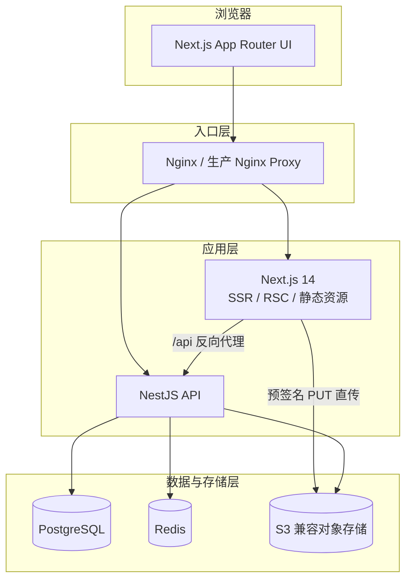
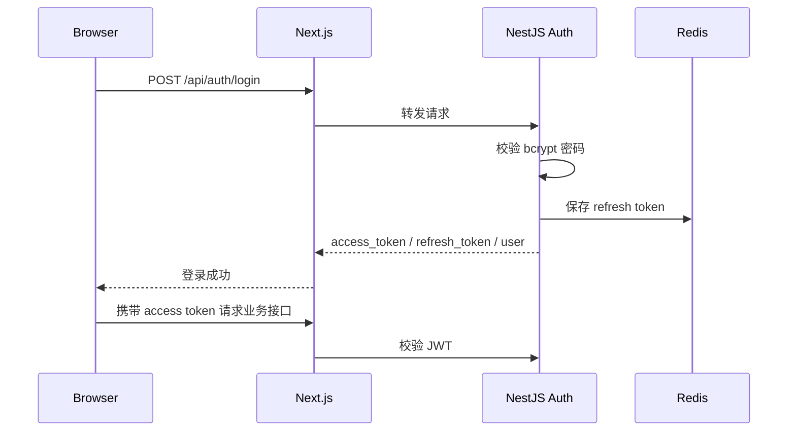
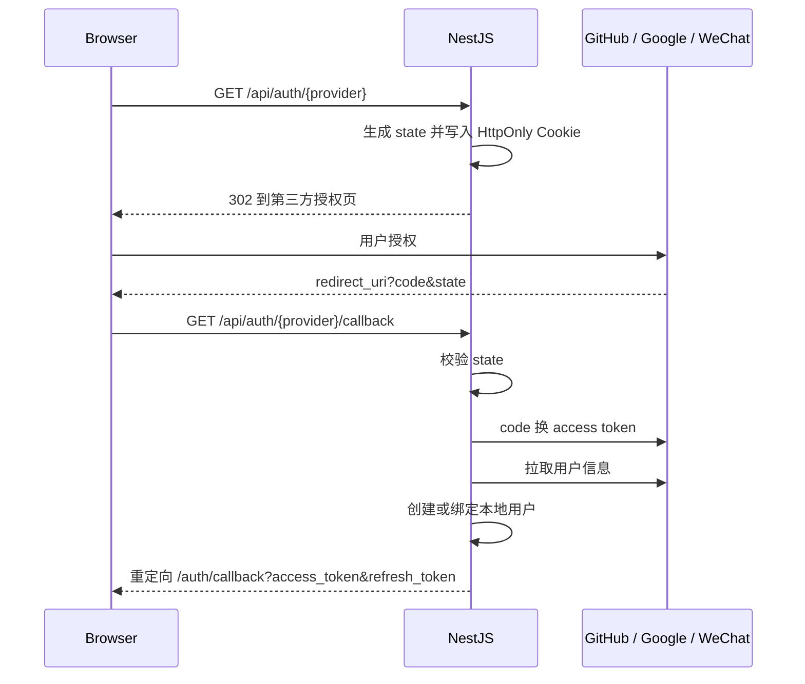
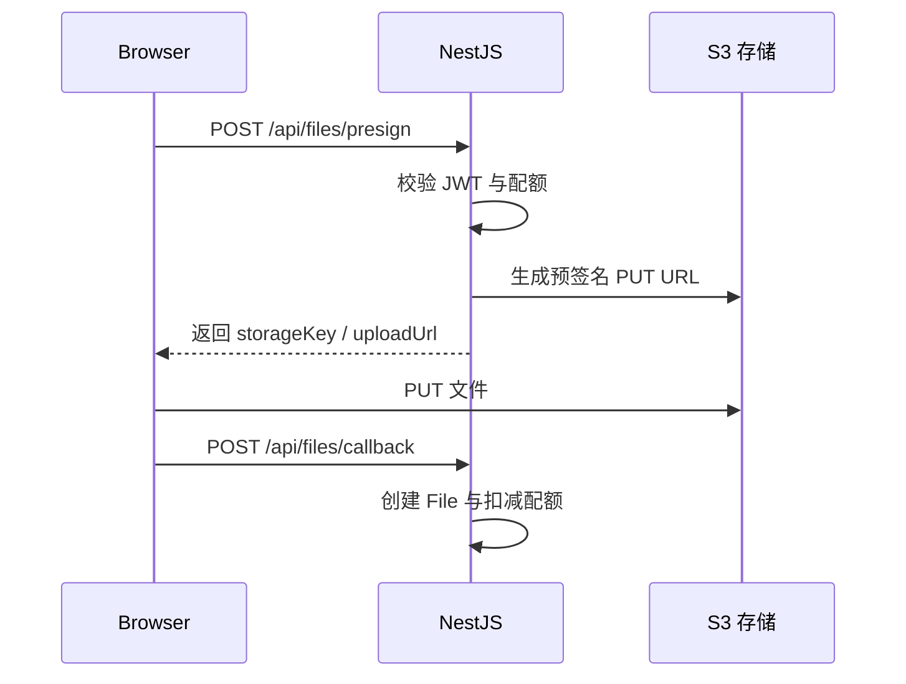
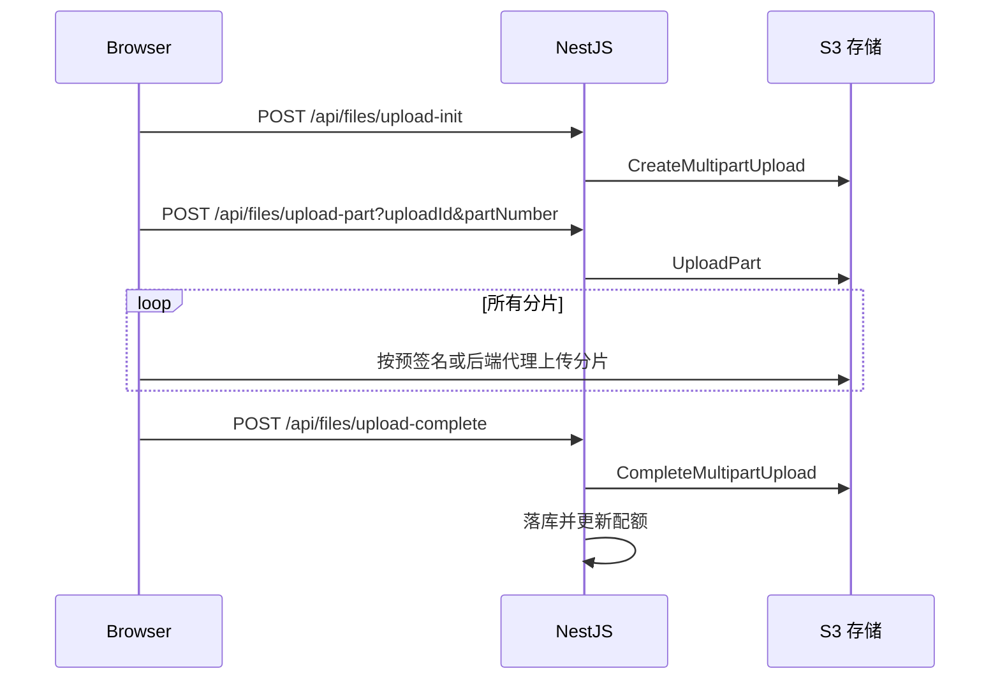

# 架构说明

## 技术架构

## 模块职责

| 模块                    | 职责                                             |
| ----------------------- | ------------------------------------------------ |
| `client/src/app`        | 页面路由、服务端渲染、公开预览、认证页、后台页面 |
| `client/src/lib/api.ts` | Axios 实例、JWT 请求头、401 自动刷新             |
| `server/src/auth`       | 注册、登录、刷新令牌、OAuth、JWT 签发            |
| `server/src/users`      | 当前用户、昵称、密码、配额查询                   |
| `server/src/files`      | 预签名上传、分片上传、文件列表、删除、统计       |
| `server/src/public`     | 公开文件元信息、内容流、浏览 / 下载统计          |
| `server/src/admin`      | 用户管理、套餐调整、平台统计                     |
| `server/prisma`         | 数据模型、迁移、seed                             |

## 认证流程

## OAuth 流程

## 小文件上传流程

## 大文件分片上传流程

## 公开访问流程

1. 访问 `/f/:urlKey`。
2. 前端请求 `GET /api/public/files/:urlKey`。
3. 后端校验文件未删除且非私有，返回元信息和临时预览 URL。
4. 前端根据 MIME 类型渲染预览器。
5. 用户访问下载地址时，后端记录下载日志并重定向到预签名下载 URL。
