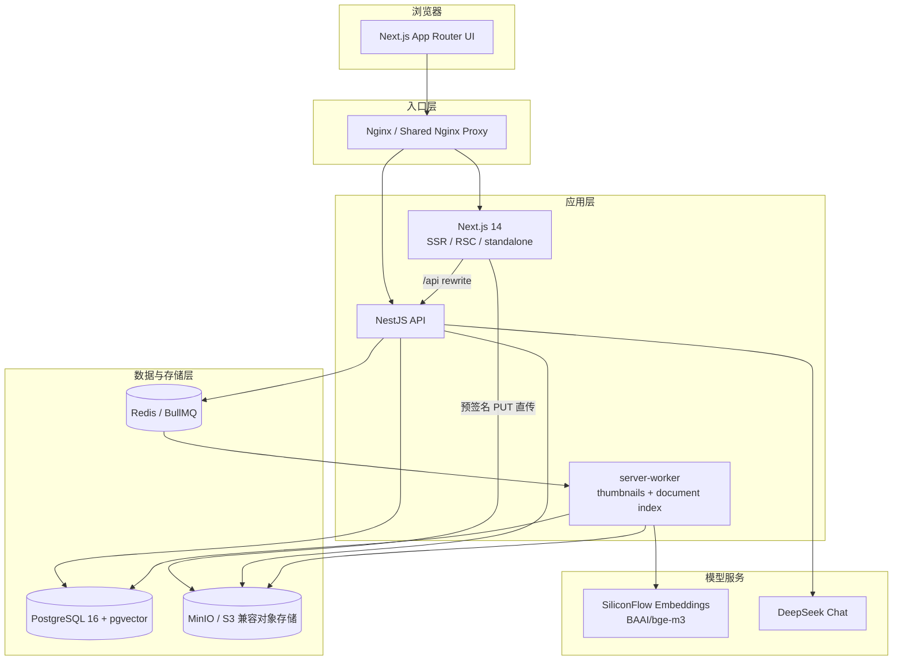
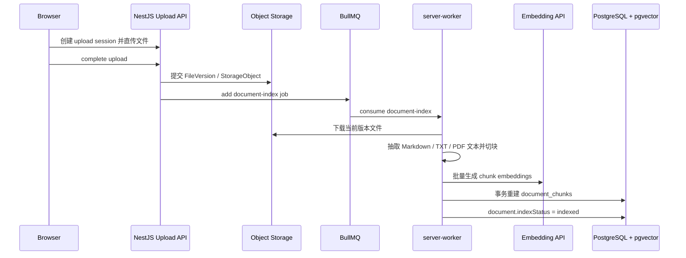
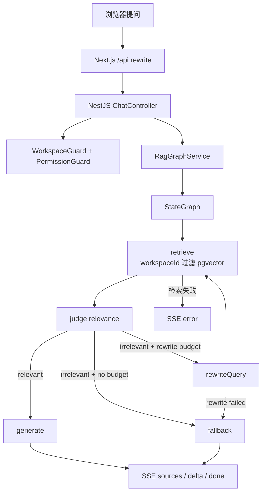
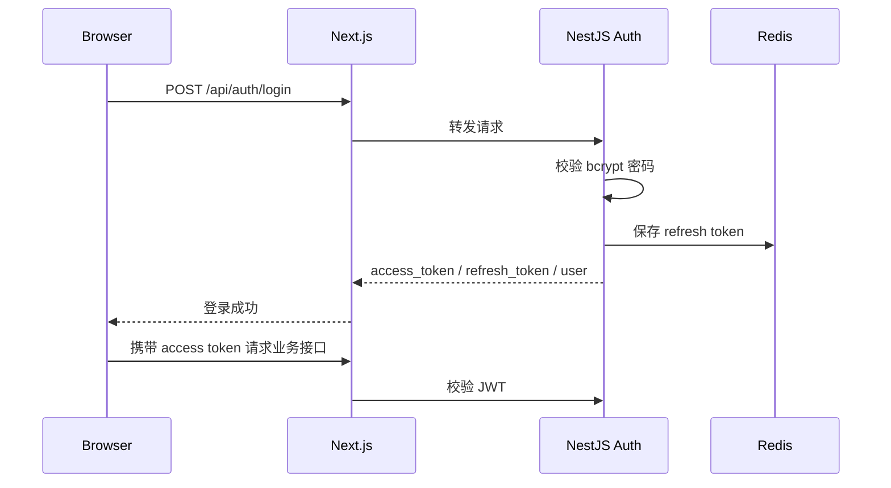
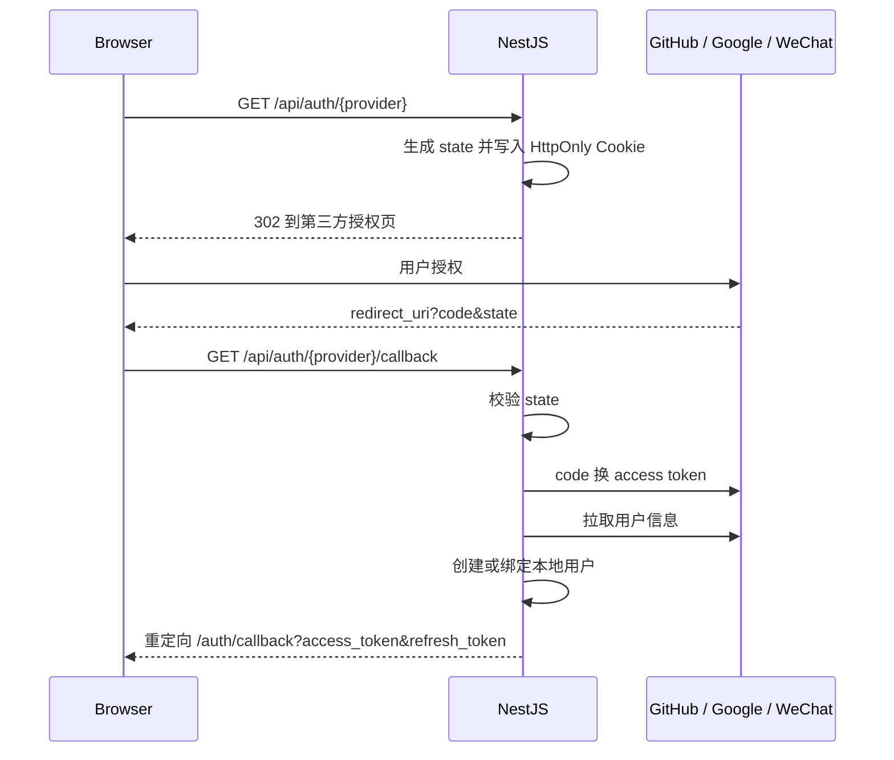
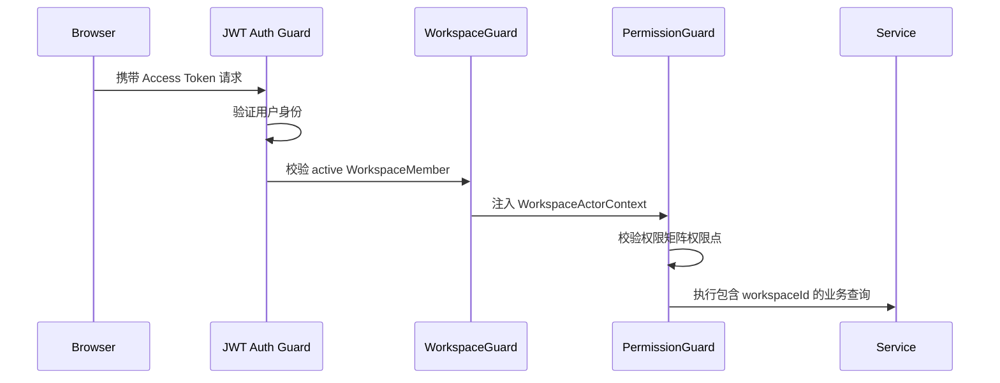

# 架构说明

## 总体架构


```mermaid
flowchart TB
  subgraph Client["浏览器"]
    UI["Next.js App Router UI"]
  end

  subgraph Edge["入口层"]
    Proxy["Nginx / Shared Nginx Proxy"]
  end

  subgraph App["应用层"]
    Next["Next.js 14<br/>SSR / RSC / standalone"]
    Nest["NestJS API"]
    Worker["server-worker<br/>thumbnails + document index"]
  end

  subgraph Data["数据与存储层"]
    PG[(PostgreSQL 16 + pgvector)]
    Redis[(Redis / BullMQ)]
    S3[(MinIO / S3 兼容对象存储)]
  end

  subgraph AI["模型服务"]
    Embedding["SiliconFlow Embeddings<br/>BAAI/bge-m3"]
    LLM["DeepSeek Chat"]
  end

  UI --> Proxy
  Proxy --> Next
  Proxy --> Nest
  Next -->|"/api rewrite"| Nest
  Next -->|"预签名 PUT 直传"| S3

  Nest --> PG
  Nest --> Redis
  Nest --> S3
  Nest --> LLM

  Redis --> Worker
  Worker --> S3
  Worker --> Embedding
  Worker --> PG
```

## 模块职责

| 模块                         | 职责                                                     |
| ---------------------------- | -------------------------------------------------------- |
| `client/src/app`             | 页面路由、SSR、公开预览、认证页、workspace 页面          |
| `client/src/features/upload` | SHA-256、会话创建、直传/分片、重试、队列状态             |
| `client/src/features/chat`   | POST SSE 解析、会话状态、引用展示、停止与重试            |
| `client/src/lib/api.ts`      | Axios 实例、JWT 请求头、401 自动刷新                     |
| `server/src/auth`            | 注册、登录、刷新令牌、OAuth、JWT 签发                    |
| `server/src/users`           | 当前用户、昵称、密码、配额查询                           |
| `server/src/files`           | workspace 文件列表、删除、reindex、内容访问、统计        |
| `server/src/upload`          | 上传会话、秒传、分片、合并锁、配额确认                   |
| `server/src/storage`         | MinIO / 七牛云驱动抽象和预签名 URL                       |
| `server/src/queue`           | BullMQ 队列封装和幂等 job 管理                           |
| `server/src/documents`       | 文本抽取、切块、Embedding、pgvector 检索、异步索引       |
| `server/src/chat`            | SSE 契约、LangGraph RAG、相关性判断、query rewrite、兜底 |
| `server/src/evaluation`      | 20 题评估集、answer judge、指标、JSON/Markdown 报告      |
| `server/src/workspaces`      | workspace、成员、邀请、RBAC、审计上下文                  |
| `server/src/public`          | 公开文件元信息、内容流、浏览 / 下载统计                  |
| `server/src/admin`           | 用户管理、套餐调整、平台统计                             |
| `server/prisma`              | 数据模型、迁移、seed                                     |

## 知识库索引链路


```mermaid
sequenceDiagram
  participant B as Browser
  participant A as NestJS Upload API
  participant S as Object Storage
  participant Q as BullMQ
  participant W as server-worker
  participant E as Embedding API
  participant P as PostgreSQL + pgvector

  B->>A: 创建 upload session 并直传文件
  B->>A: complete upload
  A->>S: 提交 FileVersion / StorageObject
  A->>Q: add document-index job
  Q->>W: consume document-index
  W->>S: 下载当前版本文件
  W->>W: 抽取 Markdown / TXT / PDF 文本并切块
  W->>E: 批量生成 chunk embeddings
  W->>P: 事务重建 document_chunks
  W->>P: document.indexStatus = indexed
```

约束：

- `Document.workspaceId` 是知识库隔离边界。
- 只检索 `indexStatus = 'indexed'` 的文档。
- `document_chunks.embedding` 固定为 1024 维。
- 同一 file version 内容哈希一致时跳过重复 Embedding。
- 文件删除会同步删除 Document 与 chunks，避免已删除文件继续命中。

## RAG 问答链路


```mermaid
flowchart TB
  B[浏览器提问] --> N[Next.js /api rewrite]
  N --> C[NestJS ChatController]
  C --> G[WorkspaceGuard + PermissionGuard]
  C --> R[RagGraphService]
  R --> S[StateGraph]

  S --> RET[retrieve<br/>workspaceId 过滤 pgvector]
  RET --> J[judge relevance]
  J -->|relevant| GEN[generate]
  J -->|irrelevant + rewrite budget| RW[rewriteQuery]
  RW --> RET
  J -->|irrelevant + no budget| FB[fallback]
  RW -->|rewrite failed| FB

  GEN --> SSE[SSE sources / delta / done]
  FB --> SSE
  RET -->|检索失败| ERR[SSE error]
```

### 事件契约

```text
正常回答：sources → delta... → done
无资料兜底：sources → delta(固定兜底) → done
检索失败：error
生成失败：sources → 可能 delta → error
```

约束：

- SSE named event 固定为 `sources`、`delta`、`done`、`error`。
- final sources、prompt `[1][2][3]`、前端引用列表使用同一数组顺序。
- `maxRewrites = 1`，最多两次向量检索，避免无限循环。
- workspaceId 为空时直接拒绝检索，不进入 pgvector。
- LLM 只基于资料回答；资料不足时输出固定兜底。
- 上游错误会转成用户可读错误，不暴露 API Key 或完整响应。

## 认证流程


```mermaid
sequenceDiagram
  participant B as Browser
  participant N as Next.js
  participant A as NestJS Auth
  participant R as Redis

  B->>N: POST /api/auth/login
  N->>A: 转发请求
  A->>A: 校验 bcrypt 密码
  A->>R: 保存 refresh token
  A-->>N: access_token / refresh_token / user
  N-->>B: 登录成功
  B->>N: 携带 access token 请求业务接口
  N->>A: 校验 JWT
```

## OAuth 流程


```mermaid
sequenceDiagram
  participant B as Browser
  participant A as NestJS
  participant P as GitHub / Google / WeChat

  B->>A: GET /api/auth/{provider}
  A->>A: 生成 state 并写入 HttpOnly Cookie
  A-->>B: 302 到第三方授权页
  B->>P: 用户授权
  P-->>B: redirect_uri?code&state
  B->>A: GET /api/auth/{provider}/callback
  A->>A: 校验 state
  A->>P: code 换 access token
  A->>P: 拉取用户信息
  A->>A: 创建或绑定本地用户
  A-->>B: 重定向 /auth/callback?access_token&refresh_token
```

## 上传链路

Workspace 上传是配额受控和可恢复的：

1. 浏览器计算 SHA-256。
2. 创建 upload session。
3. 服务端按 hash 判断 instant upload；否则返回 direct URL 或分片 URL。
4. 直传对象存储。
5. complete 阶段使用 Redis merge lock、对象大小校验、配额确认。
6. 成功后创建 File / FileVersion，并触发缩略图和文档索引任务。

小文件与分片上传的差异：

| 模式      | 阈值     | 特点                             |
| --------- | -------- | -------------------------------- |
| direct    | <= 8 MiB | 单次 PUT，流程简单               |
| multipart | > 8 MiB  | 8 MiB 分片、可恢复、失败分片重试 |
| instant   | 任意大小 | 同 hash 已存在时跳过传输         |

## Workspace 权限链路


```mermaid
sequenceDiagram
  participant B as Browser
  participant J as JWT Auth Guard
  participant W as WorkspaceGuard
  participant P as PermissionGuard
  participant S as Service

  B->>J: 携带 Access Token 请求
  J->>J: 验证用户身份
  J->>W: 校验 active WorkspaceMember
  W->>P: 注入 WorkspaceActorContext
  P->>P: 校验权限矩阵权限点
  P->>S: 执行包含 workspaceId 的业务查询
```

`WorkspacesService`、`WorkspaceGuard` 和 `PermissionGuard` 由 `WorkspaceCoreModule` 统一提供。前端权限控制只用于展示，后端查询必须包含 `workspaceId`。

## 评估闭环

```text
固定 8 篇语料
→ 20 题评估集
→ RagGraphService 顺序执行
→ sources / answer / citations / rewrite / latency
→ Answer Judge + Hit@K + MRR + coverage
→ JSON + Markdown 报告
→ baseline / after-optimization 对比
```

评估覆盖：

- 单来源事实题
- 多来源综合题
- 口语化问题
- 明显无关兜底
- 空 workspace 隔离

## 部署形态

生产 compose 包含：

- `nestjs`：API 服务；
- `server-worker`：缩略图与文档索引 worker；
- `nextjs`：Next.js standalone 前端；
- `postgres`：PostgreSQL 16 + pgvector；
- `redis`：BullMQ 与认证刷新令牌存储；
- 外部 shared Nginx Proxy：TLS 和域名路由。

应用容器无状态，持久化数据集中在 PostgreSQL、Redis 和对象存储。
