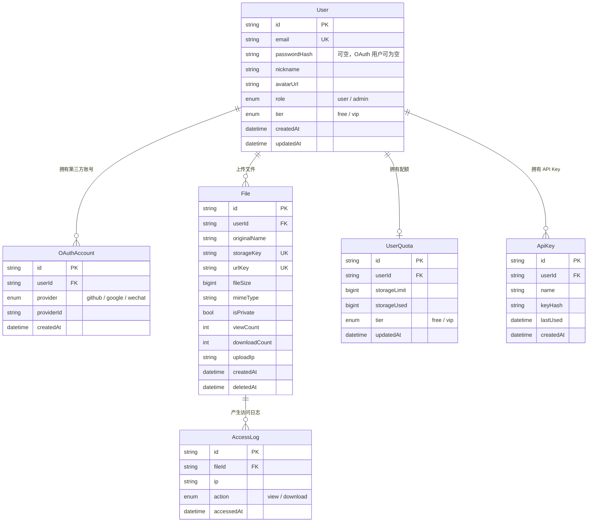

# 数据库模型

Prisma Schema：[`server/prisma/schema.prisma`](../server/prisma/schema.prisma)

## ER 图



## 关键约束

| 表 / 字段                               | 说明                                 |
| --------------------------------------- | ------------------------------------ |
| `users.email`                           | 唯一；本地邮箱登录依赖此字段         |
| `users.password_hash`                   | OAuth 创建的用户初始为空             |
| `oauth_accounts(provider, provider_id)` | 联合唯一，防止同一第三方身份重复绑定 |
| `files.storage_key`                     | 对象存储 Key，唯一                   |
| `files.url_key`                         | 分享路径标识，唯一                   |
| `files.deleted_at`                      | 软删除标记                           |
| `user_quotas.user_id`                   | 唯一，一对一                         |
| `access_logs.file_id`                   | 删除用户时会级联删除访问日志         |

## 枚举

### Role

- `user`
- `admin`

### Tier

- `free`：默认免费套餐
- `vip`：管理后台可调整

### OAuthProvider

- `github`
- `google`
- `wechat`

### AccessAction

- `view`
- `download`

## 默认配额

| 套餐 | 存储上限 |
| ---- | -------- |
| Free | 500 MB   |
| VIP  | 10 GB    |

## 工作区 RBAC 表

```mermaid
erDiagram
  User ||--o{ Workspace : owns
  User ||--o{ WorkspaceMember : joins
  Workspace ||--o{ WorkspaceMember : has
  Workspace ||--o{ WorkspaceInvitation : has
  Workspace ||--o{ File : contains
  Workspace ||--o{ AuditLog : records

  Workspace {
    string id PK
    string name
    string slug UK
    string owner_id FK
    string status
  }

  WorkspaceMember {
    string id PK
    string workspace_id FK
    string user_id FK
    string role
    string status
  }
}
```

约束：

- `workspace_members(workspace_id, user_id)` 唯一。
- 每个旧用户迁移一个 Personal Workspace。
- 旧文件已回填 `workspace_id` 和 `created_by`。
- 公开访问仍支持旧 `url_key`，但要求所属工作区 `active`。
